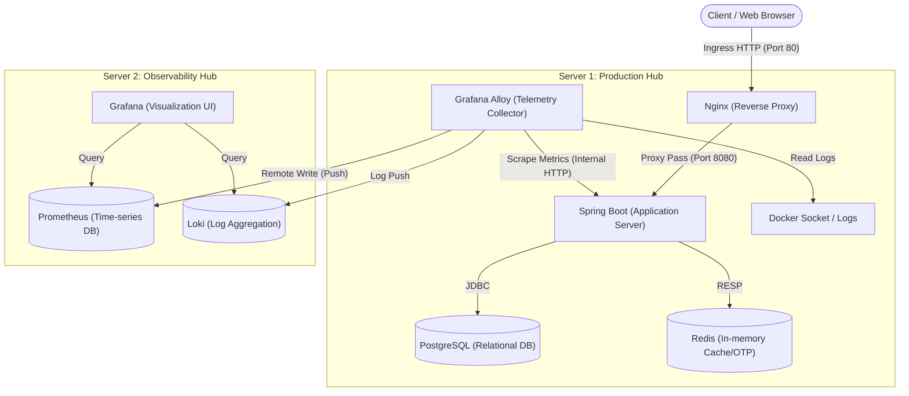
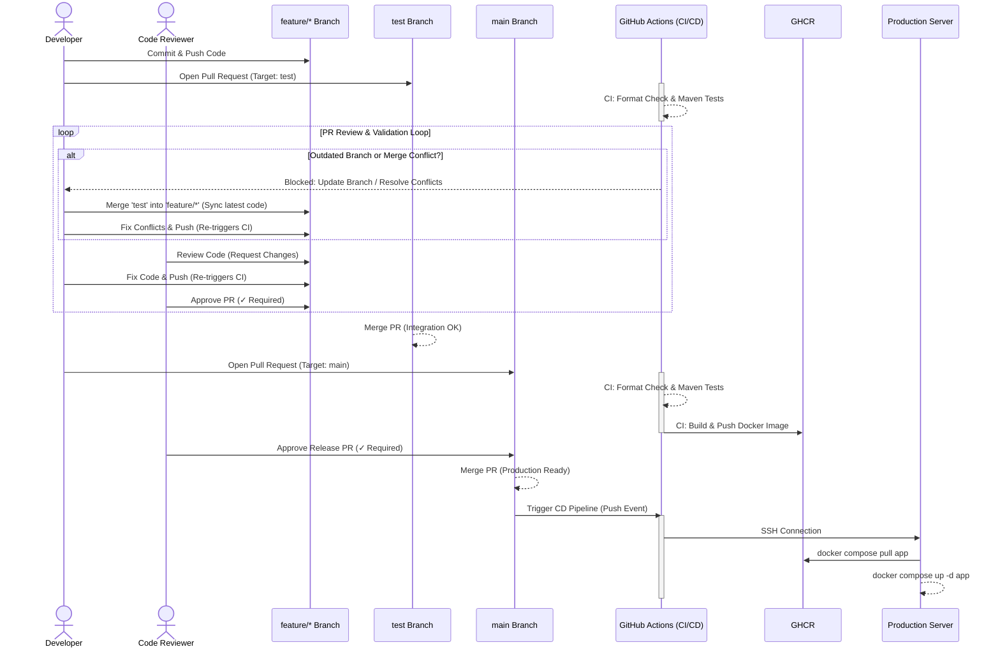

# Travery Backend: Deployment & Observability Architecture Guide

This comprehensive guide serves as training material for team members. It details the infrastructure architecture, observability model, Continuous Integration/Continuous Deployment (CI/CD) pipelines, and configuration deep-dives for the Travery Backend system.

## Table of Contents
1. [System Architecture](#1-system-architecture)
   - [1.1. Architecture Diagram](#11-architecture-diagram)
   - [1.2. Component Analysis](#12-component-analysis)
   - [1.3. Component Interactions (Deep Dive)](#13-component-interactions-deep-dive)
   - [1.4. Additional Complementary Concepts](#14-additional-complementary-concepts)
2. [Git Strategy & CI/CD Pipelines](#2-git-strategy--cicd-pipelines)
   - [2.1. Git Branching Model](#21-git-branching-model)
   - [2.2. CI/CD Workflow Diagram (Including Non-Happy Paths)](#22-cicd-workflow-diagram-including-non-happy-paths)
   - [2.3. Continuous Integration (CI) Deep Dive](#23-continuous-integration-ci-deep-dive)
   - [2.4. Continuous Deployment (CD) Deep Dive](#24-continuous-deployment-cd-deep-dive)
   - [2.5. GitHub Branch Protection Rules](#25-github-branch-protection-rules)
3. [Core Configuration Deep-Dive](#3-core-configuration-deep-dive)
   - [3.1. Application Container Orchestration (Docker Compose)](#31-application-container-orchestration-docker-compose)
   - [3.2. Application Containerization (Dockerfile Deep-Dive)](#32-application-containerization-dockerfile-deep-dive)
   - [3.3. Reverse Proxy Security (`nginx.conf`)](#33-reverse-proxy-security-nginxconf)
   - [3.4. Telemetry Collector (`alloy/config.yml`)](#34-telemetry-collector-alloyconfigyml)
   - [3.5. Server 2 Observability Hub (Prometheus & Loki)](#35-server-2-observability-hub-prometheus--loki)
4. [Initial Infrastructure Provisioning](#4-initial-infrastructure-provisioning)
   - [4.1. Docker Runtime Initialization](#41-docker-runtime-initialization)
   - [4.2. Configuration Distribution](#42-configuration-distribution)
   - [4.3. Initial Full-Stack Startup](#43-initial-full-stack-startup)
5. [Troubleshooting & Technical Pitfalls](#5-troubleshooting--technical-pitfalls)
   - [5.1. SSH Authentication Failures](#51-ssh-authentication-failures)
   - [5.2. Out-Of-Memory (OOM) Exceptions](#52-out-of-memory-oom-exceptions)
   - [5.3. SSH Non-interactive Shell Environment Variables](#53-ssh-non-interactive-shell-environment-variables)
   - [5.4. GHCR Namespace Mismatch](#54-ghcr-namespace-mismatch)
   - [5.5. Docker Compose Variable Interpolation Errors](#55-docker-compose-variable-interpolation-errors)
   - [5.6. Nginx Context Directives Conflict](#56-nginx-context-directives-conflict)

---

## 1. System Architecture

The infrastructure adopts a distributed architecture, isolating the production execution environment from the observability hub to optimize compute resources and enhance security.

### 1.1. Architecture Diagram



### 1.2. Component Analysis

This section defines the standalone function of each infrastructure component across our two-server architecture.

**Server 1 (Production Hub)**: The core node handling business logic and user traffic.
*   **Spring Boot (`travery-app`)**: The main backend application built with Java. Its sole responsibility is to process business logic, handle authentication, and expose RESTful APIs to client applications.
*   **PostgreSQL 17**: A relational database management system. Its function is to provide permanent, structured data storage for entities like Users, Tours, and Bookings.
*   **Redis 8**: An in-memory data structure store. Its function is to provide ultra-fast, ephemeral storage for caching frequently accessed data and managing time-to-live (TTL) data like OTPs (One Time Passwords) and user sessions.
*   **Nginx**: A high-performance web server acting as a Reverse Proxy. Its function is to sit at the edge of the network, receive raw HTTP traffic from the internet, filter malicious requests, and securely route valid traffic to the internal application.
*   **Grafana Alloy**: A vendor-neutral telemetry agent. Its function is to act as a silent observer that collects operational data (Logs, Metrics, Traces) from the local server environment without interfering with the business application.

**Server 2 (Observability Hub)**: The dedicated node for monitoring, alerting, and telemetry storage.
*   **Prometheus**: A time-series database. Its function is to ingest, compress, and store numerical metric data (like CPU usage percentages, memory bytes, and HTTP request counts) over time.
*   **Loki**: A highly efficient log aggregation system. Its function is to index and store massive volumes of text-based log streams, keeping them searchable without the overhead of indexing every single word.
*   **Grafana**: The visualization and dashboarding platform. Its function is to connect to data sources (like Prometheus and Loki), query their data, and render human-readable charts, graphs, and alerts for system administrators.

### 1.3. Component Interactions (Deep Dive)

While section 1.2 describes what each component is, this section explains the intricate communication mechanisms and protocols they use to interact with one another.

#### 1.3.1. Application to Database Interactions
The Spring Boot application relies on two entirely different protocols to communicate with its data layers:
*   **App ↔ PostgreSQL (via JDBC/TCP)**: Spring Boot connects to PostgreSQL over TCP port 5432 using the JDBC (Java Database Connectivity) API. We utilize a connection pool (HikariCP) to maintain a set of open, reusable connections. This avoids the massive performance penalty of establishing a new TCP handshake for every single SQL query. 
*   **App ↔ Redis (via RESP)**: Spring Boot communicates with Redis over TCP port 6379 using RESP (REdis Serialization Protocol). RESP is a highly optimized, binary-safe, and human-readable text protocol. Because it is so lightweight and easy for machines to parse, Spring Boot can execute thousands of cache reads/writes per second without network bottlenecking.

#### 1.3.2. Observability Interactions: How Alloy Collects Data
To maintain the **Push-Based Observability Model**, Grafana Alloy operates on Server 1 and acts as a localized data collector. It uses different mechanisms to gather different types of telemetry data before pushing them securely over the internet to Server 2.

*   **Alloy ↔ Docker Socket & Filesystem (Log Collection)**: 
    *   *The Mechanism*: To efficiently collect logs, Alloy uses a dual-approach. First, it connects to the Docker Daemon's API via the UNIX socket mount (`/var/run/docker.sock`). Second, it is granted direct read-only access to the physical location where Docker stores container log files on the host (`/var/lib/docker/containers:/var/lib/docker/containers:ro`).
    *   *The Interaction*: Alloy queries the `docker.sock` strictly to gather *metadata* (discovering which container ID maps to which human-readable container name like `travery-app`). Once it has the ID, it goes directly to the physical `/var/lib/docker/containers` directory to read the raw log files at maximum disk I/O speed. This separation prevents bottlenecking the Docker Daemon with heavy log streaming traffic, allowing Alloy to instantly tag logs with valuable metadata before piping them to Loki.
*   **Alloy ↔ Spring Boot (Application Metrics via Micrometer)**: 
    *   *The Mechanism*: Spring Boot does not natively speak "Prometheus". We bridge this gap using the `micrometer-registry-prometheus` dependency. Micrometer acts as a "metrics facade" deeply embedded in the JVM, tracking memory, Garbage Collection, and HTTP request latency. It translates this raw data into the specific text-based time-series format required by Prometheus and exposes it at the `/actuator/prometheus` HTTP endpoint.
    *   *The Interaction*: Every 30 seconds, Alloy acts as an HTTP client and executes a standard `GET` request to `http://travery-app:8080/actuator/prometheus`. It relies on **Docker DNS** to resolve the hostname `travery-app` to the container's internal IP address. This HTTP polling happens entirely within the isolated Docker bridge network, invisible to the outside world.
*   **Alloy ↔ Linux OS (Host Hardware Metrics)**: 
    *   *The Mechanism*: Alloy uses its built-in `unix_exporter` module to monitor the physical health of Server 1 (CPU, RAM, Disk usage).
    *   *The Interaction*: Because Alloy runs inside a container, it normally cannot see the host's hardware. We solve this by mounting core Linux virtual filesystems (`/proc` and `/sys`) from the host directly into the Alloy container as read-only volumes. Furthermore, to monitor overall disk space and partitions, we mount the entire root directory of the host into the container (`/:/rootfs:ro`). Alloy reads these files to calculate accurate, system-wide hardware statistics rather than just the statistics of its isolated container sandbox.

### 1.4. Additional Complementary Concepts

#### 1.4.1. Secrets and Environment Variable Management
To maintain strong security practices, no sensitive data (passwords, JWT keys, API tokens) is ever hardcoded into the GitHub repository or the `docker-compose-prod.yml` file. 
Instead, we utilize a strictly `.gitignore`d `.env` file that resides solely on the Production Server. Docker Compose automatically injects these values (like `${POSTGRES_PASSWORD}`) into the containers during the startup phase. This ensures that even if the source code is compromised, the production database and external integrations remain fully secure.

#### 1.4.2. Internal Service Discovery (Docker DNS)
In traditional deployments, applications communicate via static IP addresses. In our containerized architecture, IP addresses are ephemeral and change upon every deployment or container restart. 
We circumvent this by relying on Docker's embedded DNS server. All containers attached to the custom `travery-network` can resolve each other by their exact container names. For example, when Spring Boot attempts to connect to `jdbc:postgresql://postgres:5432`, the internal Docker DNS seamlessly translates `postgres` into the correct, dynamically assigned internal IP address. This enables true plug-and-play orchestration without manual IP configuration.

---

## 2. Git Strategy & CI/CD Pipelines

### 2.1. Git Branching Model
The team utilizes a structured GitHub Flow approach:
*   **`main` (Production Branch)**: Represents the exact state of the production server. Code must pass all tests before being merged. Direct pushes are strictly prohibited; updates are integrated exclusively via Pull Requests (PRs).
*   **`test` (Staging/Integration Branch)**: Serves as the integration environment. Developers merge their features here to identify conflicts and ensure stability across combined features.
*   **`feature/*` (Feature Branches)**: Isolated branches for developing specific features or bug fixes (e.g., `feature/cd-monitoring-logging`). Developers branch off `main` or `test` and submit a PR upon completion.

### 2.2. CI/CD Workflow Diagram (Including Non-Happy Paths)



**Workflow Explanation (Step-by-Step with Branch Protection Rules):**
1. **Development Phase**: A developer writes code on a `feature/*` branch and commits their changes.
2. **Integration Phase & CI Verification**: The developer opens a Pull Request (PR) from `feature` into the `test` branch. GitHub Actions triggers the **CI pipeline** to verify formatting (Spotless) and run tests (Maven). If CI fails (e.g., test fails or bad formatting), the PR is blocked until the developer pushes a fix.
3. **The Validation Loop (Non-Happy Paths)**: Before a merge is allowed, several strict branch protection rules enforce quality:
   * **Outdated Branch / Conflicts**: If the `test` branch has received new commits from other team members, the PR is blocked. The developer must fetch the latest `test` branch, merge it into their `feature` branch locally, resolve any merge conflicts, and push again. This guarantees their feature is fully compatible with the *newest* overall codebase.
   * **Code Review & Feedback**: At least one Code Reviewer must inspect the PR. If the reviewer requests changes, the developer must modify the code and push updates (which re-triggers the CI pipeline).
   * **Approval**: The PR remains blocked until all conflicts are resolved, CI is green, and the Reviewer explicitly clicks **Approve**.
4. **Pre-Production Phase (CI + Build)**: Once features are aggregated and verified in `test`, a new PR is opened targeting the `main` branch. This triggers a stricter CI pipeline that not only tests the code but also builds the Docker image and pushes it to the GitHub Container Registry (GHCR). This release PR also requires final Reviewer approval to ensure no unverified code slips into production.
5. **Deployment Phase (CD)**: Upon merging the PR into `main`, the **CD pipeline** is triggered. GitHub Actions securely SSHes into the Production Server, instructs it to pull the newly built image, and restarts the application container with zero downtime for the rest of the infrastructure.

### 2.3. Continuous Integration (CI) Deep Dive

The CI pipeline (`.github/workflows/ci.yml`) serves as the first line of defense in our infrastructure. It automatically verifies every Pull Request (PR) made to the `test` and `main` branches. The pipeline is designed as a sequence of dependent jobs, or "job chaining," ensuring that if a foundational step fails, the subsequent resource-intensive steps are never executed. Let's trace the execution flow step-by-step:

#### 1. Triggering the Workflow
The pipeline begins by listening for GitHub events. The `on: pull_request` block dictates that any PR opening, updating, or reopening against the `test` or `main` branches will immediately trigger this workflow. Next, we declare global `env:` variables like `REGISTRY: ghcr.io`, establishing a centralized configuration accessible to all downstream jobs.

#### 2. Job 1: `format-check` (The Fail-Fast Gatekeeper)
Before compiling complex code, the pipeline performs a sanity check on the code styling. 
*   **Syntax & Execution:** It uses `runs-on: ubuntu-latest` to spin up a fresh virtual machine. It checks out the code via the `actions/checkout@v6` action and provisions Java 25 via `actions/setup-java@v5`. The critical execution is `./mvnw spotless:check -q`. 
*   **Purpose:** If a developer forgot to format their code according to the team's rules, this job fails instantly (Fail-Fast mechanism). This saves valuable cloud computing time because the heavy build steps are aborted early.

#### 3. Job 2: `build-and-test` (The Core Validation)
This is where the actual compilation and validation occur. 
*   **Job Dependency:** Notice the syntax `needs: format-check`. This strictly enforces that this job will *only* start if `format-check` passes successfully. 
*   **Compilation & Testing:** After setting up Java again, it runs `./mvnw clean verify -DfailIfNoTests=false`. This command triggers Maven to compile the Java source code, run all Unit and Integration tests, and package the application.
*   **Artifact Preservation (`actions/upload-artifact@v4`):** Once Maven successfully builds the application, the resulting `.jar` file sits isolated in this specific virtual machine. When the job finishes, the VM is destroyed. To prevent losing the compiled application, this step captures the `.jar` file from `target/*.jar` and uploads it to GitHub's temporary storage under the name `app-jar`. 
*   **Test Reporting:** Finally, `dorny/test-reporter@v1` parses the generated XML test reports and injects beautifully formatted test results directly into the PR UI for the code reviewers to inspect.

#### 4. Job 3: `build-and-push` (The Containerization Phase)
This final job wraps the validated `.jar` into a Docker image and publishes it, making it ready for the CD pipeline to deploy.
*   **Targeting Production (`if: github.event.pull_request.base.ref == 'main'`):** This job *only* runs when a PR targets the `main` branch. If developers are just merging into `test`, the pipeline stops at Job 2, skipping the Docker image creation to save time and registry space.
*   **Retrieving the Build:** It uses `actions/download-artifact@v4` to pull down the `app-jar` that was saved in the previous job, placing it back into the `target/` directory so the Dockerfile can find it.
*   **Authentication & Buildx:** It authenticates into the GitHub Container Registry (`ghcr.io`) using the repository's built-in `GITHUB_TOKEN`. It also initializes `Docker Buildx` (a modernized Docker builder) to handle the image creation.
*   **Publishing (`docker/build-push-action@v6`):** This is the climax of the CI process. It reads the project's `Dockerfile`, injects the downloaded `.jar`, and pushes the final containerized image to `ghcr.io`. It strategically applies two tags: the unique `github.sha` (for precise version tracking and rollbacks) and `latest` (so the production server always pulls the newest version by default).

### 2.4. Continuous Deployment (CD) Deep Dive

The CD pipeline (`.github/workflows/cd.yml`) automates the final leg of our release process: safely deploying the newly built Docker image to the live Production Server. It acts as the bridge between GitHub and our physical infrastructure. Let's break down how this fully automated deployment mechanism works:

#### 1. Triggering the Deployment (The Safety Gate)
Unlike the CI pipeline which runs constantly, the CD pipeline is extremely guarded. The `on: pull_request: types: [closed]` block paired with `branches: [main]` means it only listens for when a PR into the `main` branch is closed. 
*   **The Final Check (`if: github.event.pull_request.merged == true`):** A PR can be closed either by being merged or being rejected/cancelled. This critical `if` statement ensures the deployment job *only* executes if the code was officially merged. If a PR was just closed without merging, the pipeline ignores it, protecting production from unapproved code.

#### 2. Establishing the Secure SSH Tunnel
To manipulate the production server, GitHub Actions needs a way to remotely log in.
*   **The Action (`appleboy/ssh-action@v1.2.2`):** We use a community-trusted action to establish an SSH connection.
*   **Authentication (GitHub Secrets):** It injects the server's IP address (`SERVER1_HOST`), the deployment username (`SERVER1_USERNAME`), and most importantly, the cryptographic private key (`SERVER1_SSH_KEY`) securely stored in GitHub repository secrets. No passwords are ever hardcoded.

#### 3. Execution: The Remote Deployment Script
Once inside the server via SSH, the pipeline executes a sequence of bash commands to update the application seamlessly.

*   **Handling the Non-Interactive Shell (`export PATH="..."`)**: GitHub Actions opens a "non-interactive" SSH session. This type of session bypasses standard Linux startup files like `.bashrc`, meaning standard commands might be missing from the path. This line forces the shell to load the standard binary directories so it can recognize the `docker` command.
*   **Registry Authentication (`docker login`)**: The server itself needs permission to download the private/internal Docker image we just built. It uses a Personal Access Token (`GHCR_PAT`) stored in secrets to authenticate the server against the GitHub Container Registry.
*   **Fetching the Update (`docker compose ... pull app`)**: Navigating to `~/travery-deployment`, the server reaches out to GHCR and downloads the newly built `travery-app:latest` image that the CI pipeline just pushed a few minutes ago.
*   **Zero-Downtime Restart (`docker compose ... up -d app`)**: This is the core deployment command. Notice we append `app` at the end. Instead of restarting the entire server (which would drop database connections and take Nginx offline), this command intelligently stops ONLY the old Spring Boot container, swaps in the new image we just pulled, and starts it up. Nginx, PostgreSQL, Redis, and Alloy experience zero interruption.
*   **Housekeeping (`docker image prune -f`)**: Every deployment downloads a new ~150MB image. To prevent the server's SSD from running out of space over time, this command deletes the old, now-unused "dangling" Docker images.
*   **Final Verification (`docker ps | grep travery-app`)**: As a final sanity check, the pipeline asks the server to list active processes and ensures the `travery-app` is actually running before marking the CD job as a "Success" in the GitHub UI.

### 2.5. GitHub Branch Protection Rules

To enforce the Git workflow and ensure the CI/CD pipeline functions effectively as an automated "gatekeeper", we utilize GitHub's Branch Protection Rules on our core branches (`main` and `test`).

**How to configure:**
Navigate to the GitHub repository -> **Settings** -> **Branches** (under Code and automation) -> Click **Add branch protection rule** (or edit an existing one).

Here is a breakdown of the specific rules we enable and *why* they are critical for securing our pipeline:

1.  **Require a pull request before merging**
    *   *What it does:* Prevents any developer (even admins) from using `git push` directly to `main` or `test` from their local terminal. All code must be pushed to a feature branch first, and then a Pull Request (PR) must be opened.
    *   *Why we use it:* This is the absolute foundation of our workflow. Without a PR, our CI pipeline (`ci.yml`) triggered by `on: pull_request` would never run. It forces all code into a structured review process.

2.  **Dismiss stale pull request approvals when new commits are pushed**
    *   *What it does:* If Developer A approves a PR, but then Developer B pushes a new commit to that same PR branch to fix a typo, Developer A's previous approval is automatically revoked.
    *   *Why we use it:* Imagine a scenario where a PR is approved, but before merging, someone pushes a malicious or broken commit. If the old approval still held, the broken code could be merged. This rule ensures that the *exact* code being merged has been reviewed, not just an older version of it.

3.  **Require status checks to pass before merging**
    *   *What it does:* This directly links our CI pipeline to the merge button. The merge button stays disabled (greyed out) until the specified GitHub Action jobs report a "Success" status.
    *   *Required Checks:* We mandate that **"Format & Import Check"** and **"Build & Run Tests"** must pass. For the `main` branch, we additionally mandate **"Build and Push Docker Image"**.
    *   *Why we use it:* This is the technical enforcement of our "Fail-Fast" mechanism. Even if a reviewer mistakenly approves bad code, GitHub will physically block the merge if the tests fail or the code doesn't compile, saving Production from outages.
    *   *Sub-rule - Require branches to be up to date before merging:* This forces the feature branch to pull the latest changes from `main`/`test` before testing. It prevents "integration bugs" where code works in isolation but breaks when combined with recently merged features.

4.  **Do not allow bypassing the above settings**
    *   *What it does:* By default, repository Administrators can override branch rules and force-merge a broken PR. Ticking this box revokes that privilege; the rules apply strictly to everyone.
    *   *Why we use it:* "With great power comes great responsibility, but sometimes admins make mistakes too." In the heat of a production incident, an admin might be tempted to bypass CI to push a quick fix, which often leads to more severe bugs. This rule enforces discipline: *All code, no matter who wrote it, must pass the CI pipeline.*

---

## 3. Core Configuration Deep-Dive

This section breaks down the configuration files line-by-line so team members without prior DevOps experience can fully understand the infrastructure topology.

### 3.1. Application Container Orchestration (Docker Compose)

Docker Compose is a tool for defining and running multi-container Docker applications. In the Travery-Backend project, we use two separate Compose files: `docker-compose-dev.yml` for local development and `docker-compose-prod.yml` for actual server deployment. This separation of concerns ensures developers have a lightweight, easy-to-debug environment, while production has maximum security, monitoring, and performance.

#### 3.1.1. Local Development (`docker-compose-dev.yml`)
**Purpose:** This file is exclusively for developers running the application on their local machines. It ONLY provisions the supporting infrastructure (dependencies) such as the Database (PostgreSQL) and Cache (Redis). It **does not** run the Spring Boot application (`app`), Nginx, or Alloy.
*Why?* During development, developers need to continuously run, debug, and hot-reload the Spring Boot application directly from their IDEs (IntelliJ/Eclipse). Containerizing the application during active development would require slow image rebuilds for every minor code change.

**Core Syntax & Mechanisms:**
*   **Images & Container Names**:
    ```yaml
    postgres:
      image: postgres:17-alpine
      container_name: travery-postgres
      restart: unless-stopped
    ```
    - `image`: Pulls the pre-built software from Docker Hub (using the ultra-lightweight `alpine` variant to save bandwidth and disk space).
    - `container_name`: Assigns a readable, deterministic name to the container instead of letting Docker generate a random string.
    - `restart: unless-stopped`: Defines the container's **Restart Policy**. It instructs the Docker Daemon to automatically restart the container if it crashes or if the host machine reboots. The only exception is if a developer explicitly manually stops it (e.g., using `docker stop travery-postgres`).

*   **Port Binding (Exposing Ports to Host)**:
    ```yaml
    ports:
      - "127.0.0.1:${POSTGRES_EXTERNAL_PORT}:5432"
    ```
    - This is a critical configuration for the DEV environment. The syntax is `HOST_IP:HOST_PORT:CONTAINER_PORT`.
    - `127.0.0.1`: **Security enforcement**. It forces Docker to bind the port *only* to the developer's localhost loopback interface. This prevents anyone else on the local Wi-Fi network from accessing the database while the developer is working.
    - `${POSTGRES_EXTERNAL_PORT}`: Uses environment variable interpolation from the local `.env` file. This allows developers to easily change the external port (e.g., to 5433) if their default 5432 port is already occupied by another local application, preventing "Port Already in Use" errors.

*   **Healthcheck (Automated Readiness Probes)**:
    ```yaml
    healthcheck:
      test: ["CMD-SHELL", "pg_isready -U ${POSTGRES_USER} -d ${POSTGRES_DB}"]
      interval: 10s
      timeout: 5s
      retries: 5
    ```
    - A mechanism that automatically verifies if the database has fully initialized and is ready to accept TCP connections, rather than just checking if the container process has started. This ensures dependent tools know exactly when the database is truly ready for use.

*   **Environment Variable Injection Mechanism (DEV)**:
    - In the development ecosystem, environment variables are managed distinctly from production to prioritize developer convenience. 
    - The `.env` file at the root of the project is automatically read by Docker Compose when running `docker compose -f docker-compose-dev.yml up`. This allows dynamic resolution of variables like `${POSTGRES_EXTERNAL_PORT}` directly within the `docker-compose-dev.yml` file.
    - *However*, the Spring Boot application (running directly in the IDE, not in Docker) handles configuration differently. When you run the app locally, you activate the `dev` profile (`spring.profiles.active=dev`), instructing Spring Boot to load `application-dev.yml` and `application.yml` as a fallback base. 
    - Unlike production, where Docker forcefully injects the `.env` variables into the container's OS, `application-dev.yml` typically relies on hardcoded local defaults (e.g., `jdbc:postgresql://localhost:5432/travery`) or relies on an external plugin/IDE configuration to load `.env` variables if needed. This decoupled approach ensures that developers can run the app locally without relying on Docker's internal networking or complex environment variable injection scripts.

*   **Storage Mechanism: Named Volumes (Persistent Data)**:
    ```yaml
    volumes:
      - postgres_data:/var/lib/postgresql/data
    ```
    - Docker containers are ephemeral; when a container is destroyed, all data inside it is lost. To persist data, we use **Named Volumes**. Docker creates a managed storage area on the host machine's hard drive and mounts it into the container's `/var/lib/postgresql/data` directory. This ensures database records survive container restarts and rebuilds.

#### 3.1.2. Production Deployment (`docker-compose-prod.yml`)
**Purpose:** This file represents the complete architectural blueprint for actual Server deployment. It orchestrates the ENTIRE ecosystem simultaneously: The Spring Boot Application (`app`), Security Proxy (Nginx), Databases (Postgres, Redis), and Telemetry Agent (Alloy).

**Advanced Syntax & Production Mechanisms:**
*   **The App Service & Startup Ordering**:
    ```yaml
    app:
      image: ghcr.io/${GITHUB_REPOSITORY_OWNER}/travery:latest
      depends_on:
        postgres:
          condition: service_healthy
    ```
    - In production, the Spring Boot application is fully containerized and downloaded from the GitHub Container Registry (GHCR).
    - `depends_on`: Manages the **Startup Order**. It forces the Spring Boot container to hold its startup sequence until the `postgres` container explicitly reports a `service_healthy` status. This completely eliminates application crashes caused by attempting to connect to a database that is still booting up.

*   **Environment Variable Injection Mechanism**:
    ```yaml
    environment:
      SPRING_PROFILES_ACTIVE: prod
      POSTGRES_DB: ${POSTGRES_DB}
      OTP_LENGTH: ${OTP_LENGTH:-6}
    ```
    - **How it works:** Hardcoding passwords or secrets in Git or `docker-compose.yml` is a severe security vulnerability. Instead, we use a 3-tier injection system to seamlessly pass variables from the Server into Spring Boot:
      1.  **The `.env` File**: A git-ignored file sits securely on the production server containing the actual secrets.
      2.  **Docker Compose Interpolation**: When we run `docker compose up`, Docker reads the `.env` file and substitutes `${POSTGRES_DB}` with the real value. The syntax `${VAR:-default}` means "Use `VAR` from `.env`; if it doesn't exist, fall back to `default`". Docker then injects these variables into the running container's isolated OS environment.
      3.  **Spring Boot Consumption**: The `SPRING_PROFILES_ACTIVE: prod` variable tells Spring Boot to load `application-prod.yml` (ignoring `application-dev.yml`). Inside `application-prod.yml`, Spring Boot uses the syntax `${POSTGRES_DB}` to dynamically pull the value directly from the container's OS environment variables. This allows the exact same `.jar` file to behave differently based purely on the environment it's running in.

*   **Internal Networking (Zero Trust)**:
    ```yaml
    networks:
      - travery-network
    ```
    - In stark contrast to DEV (where we use `ports` to expose databases to the host IDE), on Production, Postgres and Redis **do NOT have a `ports` section**.
    - All containers are placed into an isolated virtual network called `travery-network`. They communicate with each other exclusively via internal Docker DNS using their container names (e.g., the app connects via `jdbc:postgresql://postgres:5432/...`). Because no ports are bound to the host, external hackers cannot reach the databases, even if they know the IP address of the server.

*   **Log Rotation (Preventing Disk Exhaustion)**:
    ```yaml
    logging:
      driver: "json-file"
      options:
        max-size: "10m"
        max-file: "3"
    ```
    - By default, Docker captures all console logs indefinitely. Over months of uptime, this will consume 100% of the server's disk space. This configuration enforces log rotation: it keeps a maximum of 3 log files, each capped at 10MB (max 30MB per container).

*   **Storage Mechanism: Bind Mounts (Low-Level File Sharing)**:
    ```yaml
    alloy:
      volumes:
        - ./alloy/config.yml:/etc/alloy/config.yml:ro
        - /var/run/docker.sock:/var/run/docker.sock:ro
    ```
    - Unlike Named Volumes (which Docker manages invisibly), **Bind Mounts** map specific, exact file paths from the Host OS directly into the container. 
    - ` ./alloy/config.yml:/etc/alloy/config.yml:ro` maps our custom configuration file into the Alloy container.
    - `/var/run/docker.sock:/var/run/docker.sock:ro` gives Alloy direct access to the Host's Docker Daemon socket so it can monitor other containers.
    - The `:ro` (Read-Only) suffix is a critical security measure. It ensures that the container can only *read* these files. Even if Alloy is compromised, the attacker cannot alter the host's configuration files or delete the Docker socket.

### 3.2. Application Containerization (Dockerfile Deep-Dive)

This section explains the multi-stage `Dockerfile` used to containerize the Spring Boot application. The architecture of this Dockerfile represents the industry-standard **"Multi-Stage Build"** pattern combined with **"Spring Boot Layering"**. It is specifically optimized to ensure maximum CI/CD performance, top-tier security, and minimal storage size.

#### 3.2.1. Concept: Docker Layers & Caching Optimization
Before analyzing the file line-by-line, it is crucial to understand how Docker processes instructions:
*   **The Layer Cake:** Every `RUN`, `COPY`, or `ADD` command in a Dockerfile creates a new, immutable "layer" stacked on top of the previous one.
*   **The Caching Rule:** Docker caches each layer. When rebuilding an image, Docker checks if the instruction and the files it references have changed. If *not*, it reuses the cached layer. **However, if a layer is invalidated (because files changed), ALL subsequent layers below it are also invalidated and must be rebuilt.**
*   **The Optimization Strategy:** To achieve lightning-fast builds, we must place instructions that change rarely (like downloading internet libraries) at the TOP of the file, and instructions that change frequently (like compiling our own source code) at the BOTTOM. You will see this strategy applied rigorously in both stages below.

#### 3.2.2. STAGE 1: BUILD (The Compilation Phase)
In this stage, the goal is to compile the raw Java source code into an executable `.jar` file and extract its internal layers.

*   `FROM maven:3.9-eclipse-temurin-25 AS builder`
    *   Defines the base image for compilation. We use an image containing the Maven build tool and the full Java 25 Development Kit (JDK).
    *   `AS builder`: Names this temporary stage "builder" so we can reference it later to grab files from it.
    *   > **Where do these Base Images come from?**
        > Base images are sourced from **Docker Hub** (`https://hub.docker.com/`), the official public registry for container images. When choosing a base image to start a project, you search Docker Hub for the "Official Image" badge (e.g., searching for `maven`, `eclipse-temurin`, or `postgres`). The platform lists all available tags (versions), allowing you to pick the exact OS and software version your project requires.

*   `WORKDIR /app`
    *   Sets the working directory inside the container to `/app`. All subsequent commands will be executed here.

*   `COPY pom.xml ./`
    *   Copies ONLY the `pom.xml` file from your laptop/server into the container. 
    *   *Why not copy the source code yet?* To protect the cache. Source code changes every day; `pom.xml` changes rarely.

*   `RUN mvn dependency:resolve -B`
    *   Downloads all Maven dependencies (Spring, Hibernate, etc.) listed in the `pom.xml`. 
    *   Because this is done *before* copying the Java source code, Docker caches this massive download step. If you only change a `.java` file, Docker completely skips downloading the internet dependencies on the next run, saving 2-3 minutes of build time.
    *   **Flag `-B` (`--batch-mode`)**: This tells Maven to run in non-interactive mode. By default, Maven prints thousands of lines of ASCII progress bars when downloading libraries. `-B` disables this, keeping the Docker and CI/CD logs clean, readable, and preventing log buffer overflows.

*   `COPY src ./src`
    *   Now, copy the actual Java source code into the container.

*   `RUN mvn clean package -DskipTests -B`
    *   Compiles the code and packages it into a `.jar` file located in the `target/` directory.
    *   **Flag `-DskipTests`**: Instructs Maven to completely bypass compiling and running unit/integration tests. *Why?* Because in a proper CI/CD workflow, tests have already been strictly verified in a previous dedicated GitHub Actions job. Re-running them inside the Docker build is redundant and wastes compute time.
    *   **Flag `-B` (`--batch-mode`)**: Again, ensures the compilation log output remains clean by suppressing interactive prompts and download progress bars.

*   `RUN java -Djarmode=layertools -jar target/*.jar extract`
    *   **The Spring Boot Magic**: A standard Spring Boot "Fat Jar" contains both your tiny code and ~100MB of third-party libraries bundled together. If we just copy the `.jar` directly into an image, any small code change (like fixing a typo) invalidates the entire 100MB layer, forcing a massive upload during deployment.
    *   This command mathematically extracts the `.jar` into **4 separate component folders**:
        1.  **`dependencies`**: Contains regular third-party libraries (e.g., Spring framework, PostgreSQL driver). *Changes very rarely.*
        2.  **`spring-boot-loader`**: The core Spring classes required to boot the application. *Changes almost never.*
        3.  **`snapshot-dependencies`**: Third-party libraries that are still under development (versions ending in `-SNAPSHOT`). *Changes occasionally.*
        4.  **`application`**: The actual compiled `.class` files of our Travery-Backend project and `application.yml`. *Changes every single time we push a commit.*

#### 3.2.3. STAGE 2: RUNTIME (The Production Phase)
In this stage, we discard all the heavy compilation tools (Maven, JDK, raw source code) and only keep the absolute bare minimum needed to run the app on the Production Server.

*   `FROM eclipse-temurin:25-jre AS runtime`
    *   Defines the runtime image. Notice we use `jre` (Java Runtime Environment) instead of JDK. This drastically reduces the final image size (from ~400MB down to ~150MB) and minimizes the security attack surface.

*   `RUN groupadd --system appgroup && useradd --system --gid appgroup appuser`
    *   **Deep Dive: Principle of Least Privilege**
        *   **The Threat:** By default, Docker runs applications as the `root` user (UID 0) inside the container. If a hacker exploits a vulnerability in your Java app (e.g., an unsafe file upload, or a vulnerability like Log4Shell leading to Remote Code Execution), they inherit the permissions of the application. If the app is `root`, the hacker can install malware, alter critical system binaries, or attempt a "Container Breakout" to attack the underlying physical Server.
        *   **The Solution:** This command creates a restricted, non-root user (`appuser`) and group (`appgroup`) with zero administrative privileges. We strip the application of its `root` powers.

*   `WORKDIR /app`
    *   Sets the working directory for the final runtime container.

*   `COPY --from=builder /app/dependencies/ ./`
*   `COPY --from=builder /app/spring-boot-loader/ ./`
*   `COPY --from=builder /app/snapshot-dependencies/ ./`
*   `COPY --from=builder /app/application/ ./`
    *   **Applying Layer Optimization**: We copy the 4 extracted components from the `builder` stage into this final clean image.
    *   *Order absolutely matters!* We copy them strictly in order of "least likely to change" to "most likely to change". 
    *   When you push a code update, Docker checks the layers. It sees the `dependencies` haven't changed and reuses the cached layer. It eventually reaches `application`, realizes the code changed, and only rebuilds that specific layer (a few Kilobytes). This makes pushing to GHCR and the Server pulling the image blazing fast.

*   `RUN chown -R appuser:appgroup /app`
    *   Because we created a restricted user, it cannot access files created by root. This command grants `appuser` ownership of the `/app` directory so it has permission to read and execute the Java files.

*   `USER appuser`
    *   Instructs Docker to physically switch the executing user context from `root` to `appuser`. The application is now running securely under the Principle of Least Privilege. If the app is compromised, the attacker is trapped as a powerless user.

*   `EXPOSE 8080`
    *   Documentation purpose only. Tells anyone reading this file that the container listens on port 8080 internally.

*   `ENTRYPOINT ["java", "org.springframework.boot.loader.launch.JarLauncher"]`
    *   The command that actually starts the Spring Boot application.
    *   Notice we are NOT running the traditional `java -jar app.jar`. Instead, we use Spring's highly optimized `JarLauncher`. This launcher knows how to stitch the 4 extracted component layers back together directly in RAM and boots the application up to 30% faster than standard Jar execution.

### 3.3. Reverse Proxy Security (`nginx.conf`)
Nginx sits at the edge of our network, receiving all internet traffic and deciding where it goes.

```nginx
# 1. Define the backend application cluster
upstream spring_backend {
    server travery-app:8080; 
}

server {
    # 2. Listen for standard HTTP traffic
    listen 80;
    server_name _; # Accept traffic for any domain name/IP

    # 3. SECURITY RULE: Block external access to Actuator endpoints
    # Spring Boot Actuators expose sensitive metrics and environment data.
    # We use 'deny all' to return a 403 Forbidden error to anyone from the internet.
    # Note: Our internal Grafana Alloy agent bypasses Nginx and accesses the app directly.
    location /actuator/ {
        deny all;
        return 403;
    }

    # 4. ROUTING RULE: Main application traffic
    # All other requests (e.g., /api/v1/...) are caught here.
    location / {
        # Forward the request to the upstream defined at the top
        proxy_pass http://spring_backend;
        
        # 5. Header Forwarding
        # Nginx is acting as a middleman. By default, Spring Boot would think 
        # Nginx (Internal IP) is the user. We must pass along the actual user's IP.
        proxy_set_header Host $host;
        proxy_set_header X-Real-IP $remote_addr;
        proxy_set_header X-Forwarded-For $proxy_add_x_forwarded_for;
        proxy_set_header X-Forwarded-Proto $scheme;

        # Set network timeouts to prevent hanging connections
        proxy_connect_timeout 60s;
        proxy_send_timeout 60s;
        proxy_read_timeout 60s;
    }
}
```

### 3.4. Telemetry Collector (`alloy/config.yml`)
Grafana Alloy is a highly efficient agent that collects telemetry data (Logs, Metrics, Traces). It uses a declarative language called River. Think of it as a pipeline: Source (where data comes from) -> Process (formatting) -> Write (where to send it).

**The Log Pipeline (Docker -> Alloy -> Loki):**
```river
# SOURCE: Tell Alloy to watch the Docker Engine for running containers
discovery.docker "docker_containers" {
  host = "unix:///var/run/docker.sock"
}

# COLLECT: Read the raw console output from those discovered containers
loki.source.docker "docker_logs" {
  host = "unix:///var/run/docker.sock"
  targets = discovery.docker.docker_container.targets
  
  # RELABEL: Docker outputs ugly internal names. 
  # This block extracts the clean 'container_name' so we can filter easily in Grafana.
  relabel_configs {
    action = "replace"
    source_labels = ["__meta_docker_container_name"]
    target_label = "container_name"
  }
  format = "json"
}

# PROCESS: Extract fields from the JSON log payloads
loki.process "docker_logs_pipeline" {
  stage.json {
    expressions = { output = "log", stream = "stream" }
  }
  forward_to = [loki.write.loki_push.receiver]
}

# WRITE: Push the processed logs over the internet to our Loki server (Server 2)
loki.write "loki_push" {
  endpoint {
    url = "http://${LOKI_HOST}:3100/loki/api/v1/push"
  }
}
```

**The Production Metrics Pipeline (Spring Boot -> Alloy -> Prometheus):**
```river
# SOURCE 1 (Host Metrics): Collect hardware metrics (CPU, RAM, Disk) of the server itself
# Note: 'selinux' and 'schedstat' are disabled to prevent errors on unsupported Linux distros.
prometheus.exporter.unix "unix_metrics" {
  disable_collectors = ["selinux", "schedstat"]
}

# SOURCE 2 (App Metrics): Scrape CPU/RAM/JVM metrics from Spring Boot's internal actuator endpoint
prometheus.scrape "spring_boot" {
  targets = [{
    __address__ = "travery-app:8080", # Internal Docker DNS address
    __scheme__ = "http", 
    __metrics_path__ = "/actuator/prometheus",
    job = "spring-boot", 
    instance = "travery-backend"
  }]
  scrape_interval = "30s" # Poll for metrics every 30 seconds
  forward_to = [prometheus.relabel.add_server_label_receiver]
}

# PROCESS: Tag all these metrics with 'server1' so we know which VM they came from
prometheus.relabel "add_server_label" {
  rule {
    target_label = "server"
    replacement = "server1"
  }
  forward_to = [prometheus.remote_write.prometheus_push.receiver]
}

# WRITE: Push the metrics outward to Prometheus (Server 2)
prometheus.remote_write "prometheus_push" {
  endpoint {
    url = "http://${PROMETHEUS_HOST}:9090/api/v1/write"
  }
  wal {
    # Write-Ahead Log: Temporarily saves metrics to disk if the network fails, 
    # ensuring no data is lost during internet outages.
    enabled = true
    directory = "/alloy/wal"
  }
}
```

**The Local Debugging Pipeline (For Developers):**
```river
# These blocks are identical to the production pipelines above but are explicitly
# configured to push data to 'localhost:9090'.
prometheus.exporter.unix "unix_for_export" { ... }
prometheus.scrape "spring_boot_for_export" { 
  ... 
  forward_to = [prometheus.remote_write.localhost.receiver] 
}

# This is used by developers running Docker Compose on their own laptops.
# Instead of pushing to the remote Observability Hub, it pushes to a local Prometheus container
# allowing developers to test their dashboard configurations without polluting production data.
prometheus.remote_write "localhost" {
  endpoint {
    url = "http://localhost:9090/api/v1/write"
  }
}
```

### 3.4.1. Deep Dive: Telemetry Data Acquisition Mechanisms

**1. Docker Socket & Log Collection Mechanism**
*   **What is the Docker Socket?** The Docker Daemon (the core background service managing containers) listens for REST API requests via a UNIX socket located at `/var/run/docker.sock`. It acts as the command center for all container activities.
*   **How Alloy Uses It**: In our `docker-compose-prod.yml`, this socket file is mounted directly into the Alloy container as a read-only volume. This grants Alloy permission to query the Docker Daemon's API natively.
*   **The Collection Process**: Instead of parsing physical text files on the Linux filesystem, Alloy continuously streams the Docker API (acting similarly to the `docker logs -f` command). It captures the raw `stdout` and `stderr` streams from all running containers in real-time, tags them with valuable Docker metadata (container name, service name), and pipelines them to Loki.

**2. Spring Boot Actuator & Micrometer Integration**
*   **Origin of `/actuator/prometheus`**: This endpoint is not native to Spring Boot core. It is automatically generated by the combination of two specific dependencies: `spring-boot-starter-actuator` and `micrometer-registry-prometheus`.
*   **The Role of Micrometer**: Micrometer acts as an application metrics facade (analogous to what SLF4J does for logging). It hooks deep into the JVM to continuously monitor memory states (Heap/Non-heap), Garbage Collection pauses, Thread allocations, and HTTP request metrics.
*   **The Scrape Process**: Micrometer formats this raw data into the specific text-based, time-series format required by the Prometheus ecosystem. Every 30 seconds (as defined by `scrape_interval`), Alloy acts as a simple HTTP client, issuing a `GET` request to `/actuator/prometheus` to snapshot these metrics.

**3. Internal Communication via Docker DNS**
*   **The Problem**: In a dynamic container orchestration environment, container IP addresses change randomly every time they restart. Hardcoding IPs for Alloy to scrape Spring Boot would instantly break upon restart.
*   **The Docker DNS Solution**: Docker features an embedded DNS server for all user-defined bridge networks (like our `travery-network`).
*   **The Interaction**: When Alloy attempts to execute the HTTP scrape against `http://travery-app:8080`, it asks the internal Docker DNS to resolve `travery-app`. The Docker Daemon instantly maps this alias to the current internal private IP of the Spring Boot container. This entire HTTP transaction occurs strictly within the isolated Docker virtual network, bypassing the host's external network interfaces and remaining completely invisible to the public internet.


### 3.5. Server 2 Observability Hub (Prometheus & Loki)
> [!NOTE]
> *[Placeholder]*: This repository manages the Application Backend (Server 1). Configuration details and codebase for the dedicated Observability Hub (Server 2) will be documented here at a later phase when the monitoring infrastructure is finalized.


---

## 4. Initial Infrastructure Provisioning

When migrating to a new server, the CD pipeline cannot function until the initial Docker infrastructure is provisioned. 

### 4.1. Docker Runtime Initialization
Standard installation script for Ubuntu servers, establishing the foundation for containerization.
```bash
# Add official Docker GPG key and repository
sudo install -m 0755 -d /etc/apt/keyrings
sudo curl -fsSL https://download.docker.com/linux/ubuntu/gpg -o /etc/apt/keyrings/docker.asc
sudo chmod a+r /etc/apt/keyrings/docker.asc

echo "deb [arch=$(dpkg --print-architecture) signed-by=/etc/apt/keyrings/docker.asc] https://download.docker.com/linux/ubuntu $(. /etc/os-release && echo "$VERSION_CODENAME") stable" | sudo tee /etc/apt/sources.list.d/docker.list > /dev/null

# Install Docker Engine and CLI
sudo apt-get update
sudo apt-get install -y docker-ce docker-ce-cli containerd.io docker-compose-plugin

# Adhere to Least Privilege by allowing the deployment user to run Docker without root
sudo usermod -aG docker travery-deploy
```

### 4.2. Configuration Distribution
Sensitive files (`.env`) and configurations are transferred securely via SCP, bypassing Git.
```bash
scp -i ~/.ssh/travery_deploy docker-compose-prod.yml .env travery-deploy@<SERVER_IP>:~/travery-deployment/
scp -r -i ~/.ssh/travery_deploy nginx/ alloy/ travery-deploy@<SERVER_IP>:~/travery-deployment/
```

### 4.3. Initial Full-Stack Startup
Instead of only starting the `app` (as CD does), this command initializes the entire topology including Nginx and Alloy.
```bash
cd ~/travery-deployment
docker compose -f docker-compose-prod.yml up -d
```

---

## 5. Troubleshooting & Technical Pitfalls

A comprehensive log of critical incidents encountered during deployment and their respective resolutions.

### 5.1. SSH Authentication Failures
*   **Symptom**: Executing `ssh -i ~/.ssh/travery_deploy travery-deploy@<IP>` prompts for a password or returns `Permission denied`.
*   **Root Cause**: The SSH daemon lacks the corresponding public key in the deployment user's `authorized_keys` file.
*   **Resolution Script**: Login as `root` and provision the deployment user manually:
    ```bash
    # Create deployment user and grant sudo privileges
    adduser travery-deploy
    usermod -aG sudo travery-deploy
    
    # Switch context to new user
    su - travery-deploy
    
    # Securely initialize SSH directory
    mkdir -p ~/.ssh
    chmod 700 ~/.ssh
    nano ~/.ssh/authorized_keys
    # (Paste the ssh-rsa public key content here)
    
    # Lock file permissions to owner only
    chmod 600 ~/.ssh/authorized_keys
    ```

### 5.2. Out-Of-Memory (OOM) Exceptions
*   **Symptom**: Server hangs completely, SSH connections drop, and `docker ps` is unresponsive.
*   **Diagnostics**: Run the holistic hardware check script:
    ```bash
    echo -e "\n--- RAM ---" && free -h && \
    echo -e "\n--- CPU Core ---" && nproc && \
    echo -e "\n--- DISK ---" && df -h / && \
    echo -e "\n--- DOCKER STATS ---" && docker stats --no-stream --format "table {{.Name}}\t{{.MemUsage}}\t{{.CPUPerc}}"
    ```
    *(If `available` RAM under `free -h` drops below ~50MB, the Linux OOM Killer intervenes).*
*   **Root Cause**: Attempting to run Spring Boot JVM (~400MB), PostgreSQL (~100MB), OS overhead, and telemetry agents on a 1GB RAM VM (e.g., GCP `e2-micro`).
*   **Resolution**: 
    1. Scale up the VM to a minimum of 2GB RAM.
    2. Alternatively, create a Swap file to mitigate temporary memory spikes:
    ```bash
    sudo fallocate -l 2G /swapfile
    sudo chmod 600 /swapfile
    sudo mkswap /swapfile
    sudo swapon /swapfile
    echo '/swapfile none swap sw 0 0' | sudo tee -a /etc/fstab
    ```

### 5.3. SSH Non-interactive Shell Environment Variables
*   **Symptom**: CD Pipeline fails with `docker: command not found`.
*   **Root Cause**: GitHub Actions uses a Non-interactive SSH shell. Unlike an interactive login, it bypasses `.bashrc` and `.profile`, resulting in an incomplete `$PATH` that omits standard executable directories.
*   **Resolution**: Explicitly inject the `PATH` in the workflow script prior to Docker commands.

### 5.4. GHCR Namespace Mismatch
*   **Symptom**: Docker pull fails with `failed to resolve reference "ghcr.io/***/travery:latest: not found"`.
*   **Root Cause**: The CI pipeline publishes images under the Organization scope (`se346-travery`), but the production `.env` file incorrectly specified a personal account in `GITHUB_REPOSITORY_OWNER`.
*   **Resolution**: Ensure exact casing (lowercase) and accuracy in the server's `.env`:
    ```env
    GITHUB_REPOSITORY_OWNER=se346-travery
    ```

### 5.5. Docker Compose Variable Interpolation Errors
*   **Symptom**: Docker compose aborts with `invalid interpolation format for services.app.environment.OTP_LENGTH`.
*   **Root Cause**: Spring Boot and Docker Compose utilize conflicting default value syntaxes. Spring Boot uses `${VAR:default}`, whereas Docker Compose enforces the bash-compliant `${VAR:-default}` format.
*   **Resolution**: Modify `docker-compose-prod.yml` to include the hyphen:
    ```yaml
    OTP_LENGTH: ${OTP_LENGTH:-6}
    ```

### 5.6. Nginx Context Directives Conflict
*   **Symptom**: Nginx container crash-loops reporting `upstream directive is not allowed here in /etc/nginx/nginx.conf:1`.
*   **Root Cause**: The custom `nginx.conf` was mounted directly over the core `/etc/nginx/nginx.conf` file, eliminating the required root `http {}` block. Directives like `upstream` and `server` are syntactically invalid outside of an `http` context.
*   **Resolution**: Adjust the volume mount path to place the custom configuration inside the `conf.d/` directory, which Nginx automatically includes *within* its default `http` block:
    ```yaml
    # Correct Volume Mount
    volumes:
      - ./nginx/nginx.conf:/etc/nginx/conf.d/default.conf:ro
    ```
